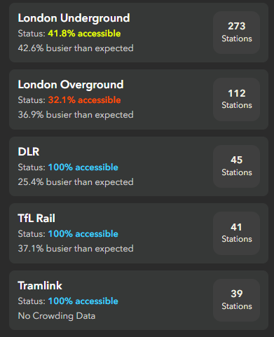
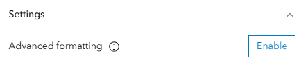

# Configure List Widgets with Arcade

How did we make this list widget?



To use Arcade in either list, table, gauge or indicator widgets, you will need to enable 'Advanced formatting' in the widget settings:



This opens up the Arcade editor, where we can define as many attribute expressions as we want in one place, all returned in a dictionary and made available to paste in our template later on.

## Calculate your expressions
The code below does similar things as our code in the Map Viewer, just all in one place:

````js
// Calculate % of stations accessible

var stations = $datapoint.total_stations
var notAccessCount = $datapoint.not_accessible_count

var percentAccessible = Round((stations - notAccessCount)/stations * 100, 1)

// Return text colours for level of accessibility
var accessibilityColours = When(
  percentAccessible < 40, "#ff4d00ff",
  percentAccessible < 50, "#e5ff00ff",
  percentAccessible > 90, "#3dd2ffff",
  "#8b8d94"
)

// Calculate percent difference in expected/actual count

var expected = $datapoint.avg_expected_crowding
var actual = $datapoint.avg_actual_crowding

var crowdingPercentDiff = Round((actual - expected)/actual * 100, 1);

// Return user friendly statement on crowding
var crowdingPercentDiffErrorHandle = When(
  IsNan(crowdingPercentDiff), 'No Crowding Data',
  crowdingPercentDiff > 0, `${crowdingPercentDiff}% busier than expected`,
  crowdingPercentDiff < 0, `${Abs(crowdingPercentDiff)}% quieter than expected`,
  `Crowding is as expected: ${expected}`
);

// Return all as attributes
return {
  textColor: '',
  backgroundColor: '',
  separatorColor:'#efefefe',
  selectionColor: '',
  selectionTextColor: '',
  attributes: {
    percentAccessible,
    accessibilityColours,
    crowdingPercentDiffErrorHandle
  }
}
````

## Put them together in html

Like popups, Dashboard list templates are built on html. The code below is some example html used to construct a list template with a custom layout (e.g., a # of stations call-out)

````
<div style="align-items:stretch;background-color:#363837;border-radius:8px;display:flex;justify-content:space-between;padding:12px;">
    <div style="padding-right:12px;">
        <div style="font-size:16px;margin-bottom:4px;">
            <strong>{field/Network}</strong>
        </div>
        <div style="color:#666;font-size:13px;">
            <span style="color:#d6d6d6;">Status:</span><span style="color:#707070;"> </span><span style="color:{expression/accessibilityColours};"><strong>{expression/percentAccessible}% accessible</strong></span>
        </div>
        <div style="color:#666;font-size:13px;margin-top:5px;">
            <span style="color:#d6d6d6;">{expression/crowdingPercentDiffErrorHandle}</span>
        </div>
    </div>
    <div style="align-items:center;background-color:#3f3f3f;border-radius:12px;color:#f4f3e4;display:flex;flex-direction:column;justify-content:center;min-width:60px;padding:8px 12px;">
        <div style="font-size:14px;line-height:1;">
            <span style="color:#f4f3e4;"><strong>{field/total_stations}</strong></span>
        </div>
        <div style="font-size:12px;">
            <span style="color:#f4f3e4;">Stations</span>
        </div>
    </div>
</div>
````
