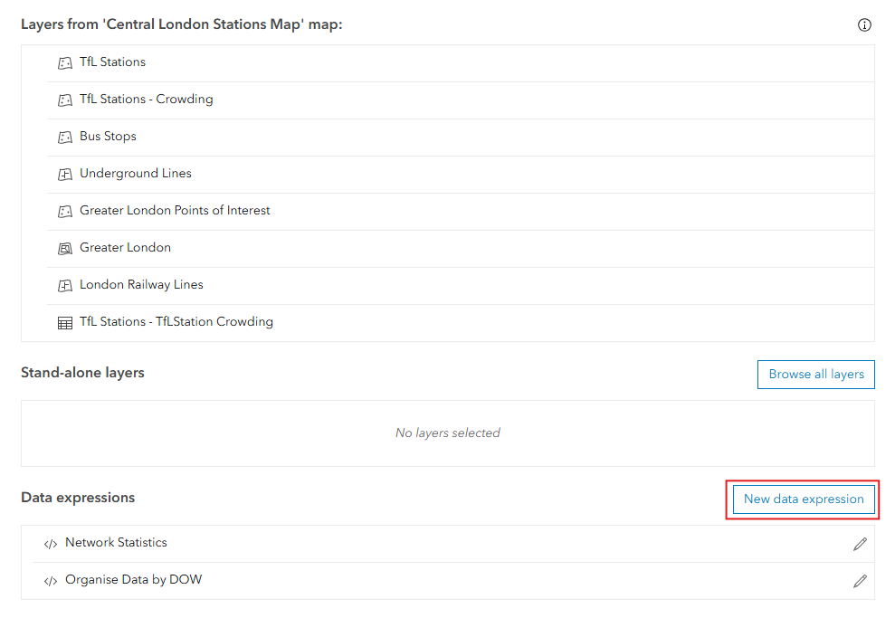

# Define a Single Instance Data Structure for a List Widget (Data Expressions)

When you have data you want to draw group level statistics from in a dashboard, using data expressions is a really handy way to do so. Data expressions can be defined at the point of widget creation:


These expressions can then be reused for other widgets in your dashboard.

The code below brings in the data we are working with and uses a GroupBy function to calculate statistics:

````js
// Define our feature set, our stations layer
var fs = FeatureSetByPortalItem(
  Portal("https://esriuk.maps.arcgis.com/"),
  "4be821cb82654f69ac83f63da92eca40",
  0
);

// fs

// Return grouped statistics by network, ordering by size of network.
return OrderBy(
  GroupBy(
    fs,
    ["Network"],
    [
      { name: "total_stations", expression: "Name", statistic: "COUNT" },
      { name: "not_accessible_count", expression: "CASE WHEN accessibility = 'Not Accessible' THEN 1 ELSE 0 END", statistic: "SUM"}, //SQL92 expression
      { name: "avg_expected_crowding", expression: "Round(average_typical_daily_count, 0)", statistic: "AVG" },
      { name: "avg_actual_crowding", expression: "Round(average_observed_daily_count, 0)", statistic: "AVG"}
    ]
  ),
  "total_stations DESC"
);
```