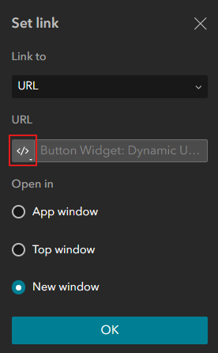

# Use Arcade to Handle Links

When setting links in Experience Builder widgets, e.g., buttons, Arcade can be used to handle potential errors and improve user experience.

When defining a link, you have the option to write an Arcade script by clicking the **</>** symbol:




Here is a simple script we used to check whether a link was missing and redirect users to a sightseeing website if none was found. This fixes broken buttons. A small change but a great usability enhancement.

````js
IIf(
  IsEmpty($feature.URL),
  "https://www.visitlondon.com/things-to-do/sightseeing/london-attraction",
  $feature.URL
)
````