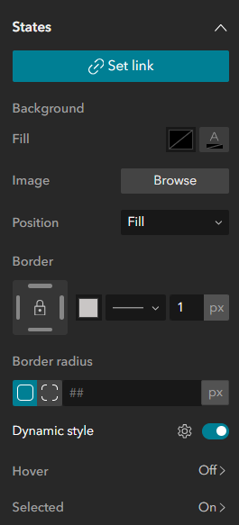

# Apply Dynamic Styles to Lists in Experience Builder

In our application, we also have a list widget that changes background colour depending on what category of data it belongs to. This is a fairly recent feature of Experience Builder but a really handy tool for your user-experience.

> **NOTE:** You can also specify background colour without using Arcade, but rather a no-code condition builder

To change list item background colours, select your list item, toggle on 'Dynamic style' and hit the settings cog to configure:



You can then select Script > Arcade Editor and write your script. Below is an example we used to change our background colour:

````js
// Specify the background colour of the list for each attraction type
{
  background:
    {
      color:
        When(
          $feature.DESCRIPTION == "Museums",
          "#5ea6b3",
          $feature.DESCRIPTION == "Art Galleries",
          "#c79a4a",
          $feature.DESCRIPTION == "Historic Buildings Including Castles, Forts and Abbeys",
          "#b35e7c",
          $feature.DESCRIPTION == "Theatres and Concert Halls",
          "#b36a5e",
          $feature.DESCRIPTION == "Historic and Ceremonial Structures",
          "#47977b",
          "#818181ff"
        )
    }
};
````

You can also set separate scripts for list styles for when a user hove's over a list item or selects it.
