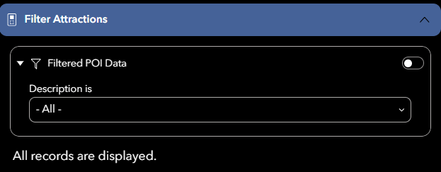
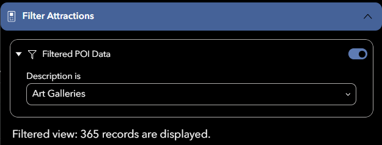
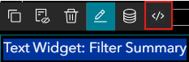

# Dynamic Content in Text Widgets

In our experience builder, we have a text widget linked to our filter, so that the text displays gives readers an idea of how many records they are looking at:



When a filter is applied:




You can do this using Arcade in the text widget itself, by double-clicking to edit the text and selecting the **</>** option to bring up the editor:




This is the code we used to link to our filter and display a message accordingly:

````js
// Get the feature layer from the Experience Builder data source
var dataSource = $dataSources["dataSource_1"].layer;

// Read the current WHERE clause applied to the data source
// This reflects filter widget
var queryString = $dataSources["dataSource_1"].queryParams.where;

// Check whether a filter is currently applied
if (!IsEmpty(queryString)) {

  // Apply the same WHERE clause to the layer
  var result = Filter(dataSource, queryString);

  // Return a message showing how many records match the filter
  return `Filtered view: ${Count(result)} records are displayed.`;
}

// If no filter is applied, return a default message
return "All records are displayed.";
````