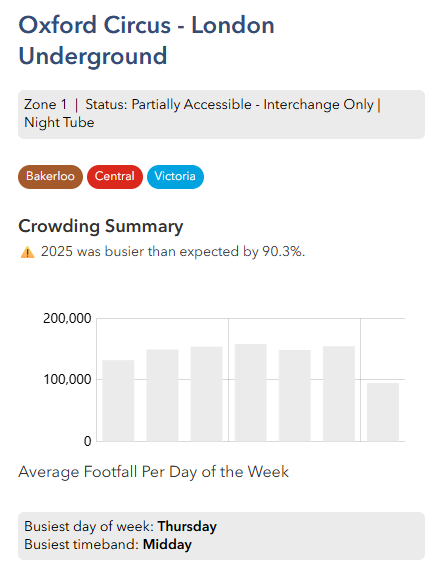
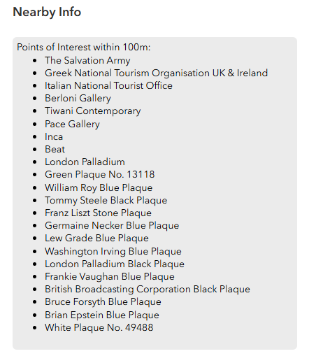
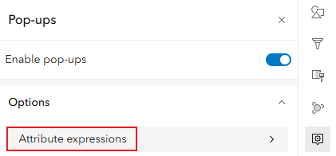
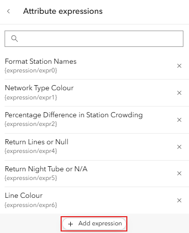
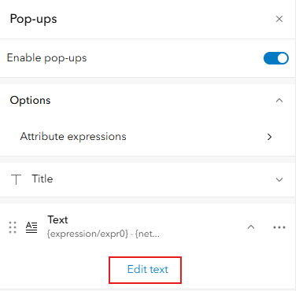
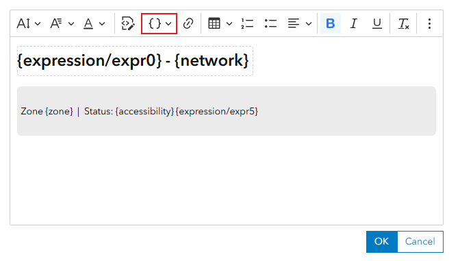

# Configuring Popups

There are two ways in which we can apply Arcade in popups:
1) Attribute expressions, which return a text or numeric field, or 
2) Blocks of Arcade that can return dictionaries. Dictionaries represent either rich text, fields tables or media like charts.

Together, we can use them to create informative and insightful displays for our readers. For example, we can use Arcade to create the following rich popup:




## Attribute Expressions

Attribute expressions allow you to write code that returns text you can place dynamically in a text element of a popup.

First, open the attribute expression menu:


Create an expression:


Once you've written an expression, add in or edit a text element in the popup menu:


You can add in dynamic content from attribute expressions as you would normal dynamic text. It pastes as a curly bracket format with the prefix expression/expr, followed by a number.


The code below contains a few example attribute expressions:

### Change Text Colour Based on an Attribute
````js
// Set the colour associated with the network.
var networkType = $feature.network;

when(
    networkType == "London Underground", "#334d76ff",  
    networkType == "TfL Rail", "#e18794ff",              
    networkType == "DLR", "#87bcbdff",                   
    networkType == "London Overground", "#e6af78ff",     
    networkType == "Tramlink", "#9ee2b7ff",              
    "#636363ff"                                
);
````

### Return a User-Friendly Statement with Statistical Information

````js
// Calculate and format the % difference in predicted vs actual station crowding

// Define variables
var expectedCount = $feature.average_typical_daily_count;
var actualCount = $feature.average_observed_daily_count;

// Avoid divide-by-zero
if (IsEmpty(expectedCount) || expectedCount == 0) {
    return null;
}

// Calculate percentage difference
var percentageDifference = ((actualCount - expectedCount) / expectedCount) * 100;

// Determine more or less busy than expected
var crowdingStatus = IIF(percentageDifference > 0, "busier", "quieter");
var crowdingTrend = IIF(percentageDifference > 0, "⚠️", "⬇️")

// Format percentage to 1 decimal place
var formattedPercentage = Round(percentageDifference, 1);

// Return in a sentence
return `${crowdingTrend} 2025 was ${crowdingStatus} than expected by ${Abs(formattedPercentage)}%.`;
````
## Arcade Blocks
We can use Arcade blocks for more complex content, such as charts and rich text. The following are examples of how we can:

### Construct Charts Using Arcade
Note how the Console() calls throughout the script help us get an idea about what is going on when we execute the script. This is great practice for troubleshooting your code and making it reusable for others.

Below, we are creating arrays that will be populated by sums of total crowding per day of week and the number of each day of week we have to give us an average crowding by DOW.

We initially create arrays that are filled with zeroes, on lines 35-38, then populate them with sums in lines 45-51. On lines 60-65, we can then divide the 2 by each other according to ordered day to return a dictionary of key value pairs - each day of the week and average crowding.

Using the **suggestions tab** in the menu, we can then return a chart element for our pop-up, using the values we have created (line 75)

````js
// -----------------------------------------------------------------------------
// Load related crowding records
// -----------------------------------------------------------------------------
var crowdingRecords = FeatureSetByRelationshipName($feature, "TfLStation_Crowding", ["day_of_week", "total_count"], false);

// Fail fast if no data exists
if (Count(crowdingRecords) == 0) {
    return {
        type: "text",
        text: "No crowding data available."
    };
}

// -----------------------------------------------------------------------------
// Define the desired order of days (controls bar order)
// -----------------------------------------------------------------------------
var orderedDays = [
    "Monday",
    "Tuesday",
    "Wednesday",
    "Thursday",
    "Friday",
    "Saturday",
    "Sunday"
];

 Console(orderedDays)

// -----------------------------------------------------------------------------
// Storage for totals and counts per day (aligned to orderedDays)
// -----------------------------------------------------------------------------
var dayTotals = []; // Initialise arrays
var dayCounts = [];

for (var i = 0; i < Count(orderedDays); i++) {
    Push(dayTotals, 0);
    Push(dayCounts, 0);
}

Console(`Day Totals: ${dayTotals}, Day Counts: ${dayCounts}`)

// -----------------------------------------------------------------------------
// Aggregate totals and counts aligned to orderedDays
// -----------------------------------------------------------------------------
for (var record in crowdingRecords) {
    var dowIndex = IndexOf(orderedDays, record.day_of_week);
    if (dowIndex > -1) {
        dayTotals[dowIndex] += record.total_count;
        dayCounts[dowIndex] += 1;
    }
}

Console(`Day Totals: ${dayTotals}, Day Counts: ${dayCounts}`)

// -----------------------------------------------------------------------------
// Build attributes dictionary with rounded averages (Monday → Sunday)
// -----------------------------------------------------------------------------
var attributes = {};
for (var d = 0; d < Count(orderedDays); d++) {
    if (dayCounts[d] > 0) {
        attributes[orderedDays[d]] = Round(dayTotals[d] / dayCounts[d], 0);
    }
}

Console(attributes)

// -----------------------------------------------------------------------------
// Return popup media element (column chart)
// -----------------------------------------------------------------------------
var colours = [];
for (var c = 0; c < Count(orderedDays); c++) {
    Push(colours, [235, 235, 235]);
}

return {
    type: "media",
    attributes: attributes,
    mediaInfos: [{
        type: "columnchart",
        title: "Average Footfall Per Day of the Week",
        altText: "Average station crowding by day of week",
        value: {
            fields: orderedDays, 
            colors: colours
        }
    }]
};
````

### Perform Spatial Analysis on Related Records

In the code snippet below, we are bringing in an unrelated dataset - not shown in our map - and seeing whether it intersects with our geometry (200m buffer around each station).

We can then use html to construct a list of nearby places of interest.

````js
// --------------------------------------------------------------------------------------
// Prepare Our Data for Analysis
// --------------------------------------------------------------------------------------

// Load Points of Interest layer - only one field to improve performance
var poiFeatureSet = FeatureSetByName(
  $map,
  "Greater London Points of Interest", // Define map layer used
  ["Name"], // Bring in just one field
  true // Bring in geometry
);

// Create buffer and find POIs within it
var featureGeometry = Geometry($feature);
var searchRadiusMeters = 200;
var searchBuffer = Buffer(featureGeometry, searchRadiusMeters);
var nearbyPOIs = Intersects(poiFeatureSet, searchBuffer);

// --------------------------------------------------------------------------------------
// Extract the names of all nearby Points of Interest
// --------------------------------------------------------------------------------------

var poiNames = []; // We store just the Name values in a simple array for easy display later

for (var poi in nearbyPOIs) {
  // Only include POIs that actually have a name value, using a '!' operator
  if (!IsEmpty(poi.Name)) {
    Push(poiNames, poi.Name);
  }
}

/* If no POIs were found within the buffer, return early with a simple message
 This avoids building empty HTML and keeps the popup meaningful. Fail fast */
if (Count(poiNames) == 0) {
  return {
    type: "text",
    text: `<div style="background-color:#ebebeb;border-radius:6px;color:black;padding:6px">
    There are no points of interest within ${searchRadiusMeters} metres of this location.
    </div>`
  };
}

// --------------------------------------------------------------------------------------
// Build the HTML for a bulleted list of POI names
// --------------------------------------------------------------------------------------

var listItemsHtml = "";

// Interate through an index-based loop and access `poiNames[i]`
for (var i = 0; i < Count(poiNames); i++) {
  listItemsHtml += `<li>${poiNames[i]}</li>`;
}

// Wrap the list in basic HTML for display in the popup
// Use <ul> so items appear as bullet points

var html =
  `<div style="background-color:#ebebeb;border-radius:6px;color:black;padding:6px">
    Points of Interest within 100m:
        <ul style="margin-bottom:0">
        ${listItemsHtml}
        </ul>
</div>`;

// --------------------------------------------------------------------------------------
// Return the popup element in the format expected by ArcGIS popups
// --------------------------------------------------------------------------------------

return {
  type: "text", 
  text: html 
};

````